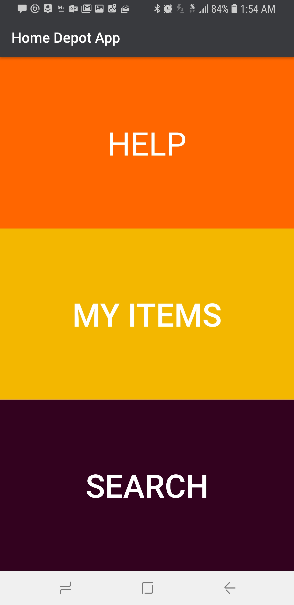
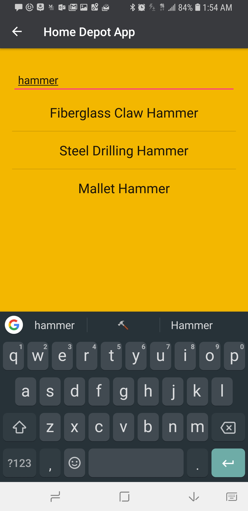
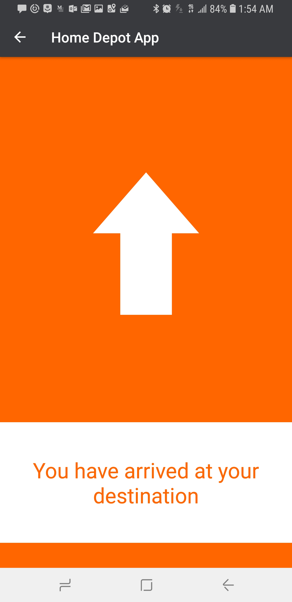

# Beacon
_1st Place Prize Winner for Home Depot Codeathalon 2018_

**By: Ishan Arya, Kyle Stachowicz, Brian Model, Rahul Bhethanabotla, Naveen Ram**

## Description
Beacon is an indoor navigation tool for Home Depot. The Android app uses the Bluetooth Low Energy API along with Bluetooth Beacons placed in each aisle to ascertain your location and calculate how to reach your desired location. The Android app is made in Kotlin.

Beacon is the product of 48 hours of determined hacking, crying, and cursing at exceptions :)